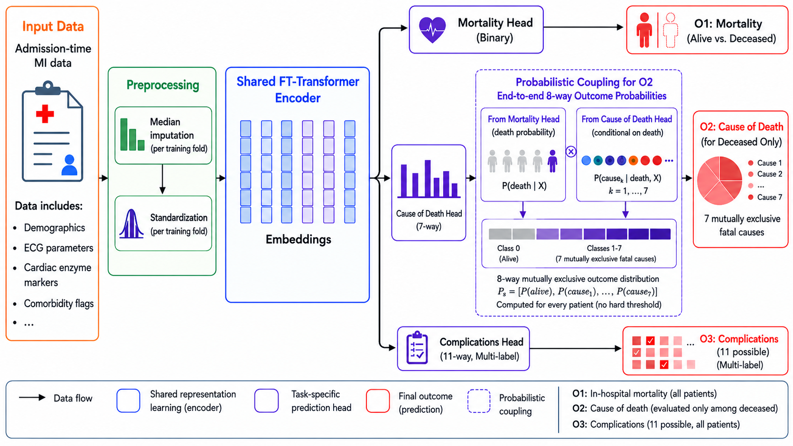

# Admission-Only Multi-Task Learning After Myocardial Infarction

### Predicting Mortality, Cause of Death, and Complications

This repository contains the experimental code and architecture diagram for the paper:

> **Admission-Only Multi-Task Learning After Myocardial Infarction: Predicting Mortality, Cause of Death, and Complications**

The project uses a **shared FT-Transformer encoder** with three task-specific prediction heads to jointly model:

- **O1 — Mortality:** binary in-hospital mortality for all patients.
- **O2 — Cause of death:** seven mutually exclusive fatal causes, evaluated among deceased patients.
- **O3 — Complications:** 11 possible complications as a multi-label prediction task.

## Model architecture

The architecture uses admission-time MI data as input, fold-safe preprocessing, a shared FT-Transformer representation, and task-specific heads. For O2, the mortality probability and conditional cause-of-death probabilities are combined probabilistically to produce an end-to-end 8-way outcome distribution.



### Output formulation for O2

For each patient:

```text
P(alive | X) = 1 - P(death | X)

P(cause_k | X) =
    P(death | X) × P(cause_k | death, X),  k = 1,...,7
```

This produces eight mutually exclusive probabilities:

```text
[ P(alive), P(cause_1), ..., P(cause_7) ]
```

No hard mortality threshold is applied in the primary hierarchical formulation.

## Experiments included

### 1. Parallel classical-ML comparison

The admission-only FT-Transformer is compared with a parallel classical pipeline using:

- Logistic Regression
- Random Forest
- Extra Trees
- Gradient Boosting
- XGBoost
- LightGBM

### 2. Time-window ablation

The primary architecture is evaluated using four cumulative information windows:

| Window | Available information |
|---|---|
| Admission | Admission-time information only |
| 24h | Admission + 24h |
| 48h | Admission + 24h + 48h |
| 72h | Admission + 24h + 48h + 72h |

### 3. Output-formulation comparison

The notebook compares:

- **Hard-gated:** a cause is predicted only when `P(death) >= 0.50`.
- **Hierarchical:** `P(death) × P(cause | death, X)` for every patient.
- **Flat 8-class:** direct prediction of alive + seven fatal causes.

### 4. SHAP interpretability

Permutation SHAP is used to examine feature importance for:

- O1 mortality
- O2 cause of death
- O3 complications

The analysis is repeated across the four time windows.

## Repository structure

```text
.
├── data/
│   ├── README.md
│   └── .gitkeep
├── docs/
│   └── architecture.png
├── notebooks/
│   └── MI_multitask_FT_Transformer_experiments.ipynb
├── results/
│   └── .gitkeep
├── .gitignore
├── requirements.txt
└── README.md
```

## Dataset

The project uses the **Myocardial infarction complications** dataset from the UCI Machine Learning Repository (dataset ID 579).

The UCI dataset contains 1,700 instances and 111 input features, with 11 complication outcomes and a lethal-outcome/cause variable. The UCI documentation defines the four prediction-time windows used by this project.

**The raw dataset is not committed to this repository.**

Download it from:

https://archive.ics.uci.edu/dataset/579/myocardial%26

Then place the original file at:

```text
data/MI.data
```

## Installation

Python 3.9+ is recommended.

```bash
git clone <YOUR-GITHUB-REPOSITORY-URL>
cd mi-multitask-ft-transformer

python -m venv .venv
source .venv/bin/activate
```

On Windows:

```powershell
python -m venv .venv
.venv\Scripts\activate
```

Install dependencies:

```bash
pip install -r requirements.txt
```

## Running the experiments

Start Jupyter:

```bash
jupyter notebook
```

Open:

```text
notebooks/MI_multitask_FT_Transformer_experiments.ipynb
```

Place `MI.data` in `data/` before running the notebook.

For the complete experiment suite, a CUDA-capable GPU is recommended. The notebook automatically uses CUDA when available and otherwise falls back to CPU.

Run the notebook from top to bottom.

Results generated by the notebook are written under:

```text
results/mi_encoder_sharing_ablation/
```

These generated results are ignored by Git so that large experiment artifacts are not accidentally committed.

## Google Colab

You can also run the notebook in Google Colab after uploading/cloning the repository and placing `MI.data` at:

```text
data/MI.data
```

The notebook no longer depends on a personal Google Drive path; all paths are repository-relative.

## Reproducibility

The notebook uses a fixed random seed:

```text
SEED = 42
```

The primary experiments use shared multilabel-stratified folds so that the model comparisons use consistent patient partitions.

The FT-Transformer configuration used by the notebook includes:

| Parameter | Value |
|---|---:|
| Token dimension | 192 |
| Transformer layers | 1 |
| Attention heads | 2 |
| FFN multiplier | 2× |
| Attention dropout | 0.3 |
| FFN dropout | 0.4 |
| Head dropout | 0.1 |
| Residual dropout | 0.1 |
| Batch size | 128 |
| Mortality loss weight | 1.0 |
| Cause-of-death loss weight | 0.4 |
| Complication loss weight | 2.0 |

## Important notes

- The raw clinical dataset is **not** included in the repository.
- The notebook performs fold-safe median imputation and standardization using the training portion of each fold.
- No SMOTE is used in the FT-Transformer experiments.
- O2 is modeled conditionally on death and coupled to the mortality head probabilistically.
- The repository contains the computational notebook; the paper remains the authoritative source for the final scientific interpretation and reported results.

## Citation

If you use this code or architecture, please cite the associated paper once the final publication details are available.

The underlying dataset should also be cited according to the UCI Machine Learning Repository citation:

> Golovenkin, S., Shulman, V., Rossiev, D., Shesternya, P., Nikulina, S., Orlova, Y., & Voino-Yasenetsky, V. (2020). *Myocardial infarction complications*. UCI Machine Learning Repository. https://doi.org/10.24432/C53P5M
